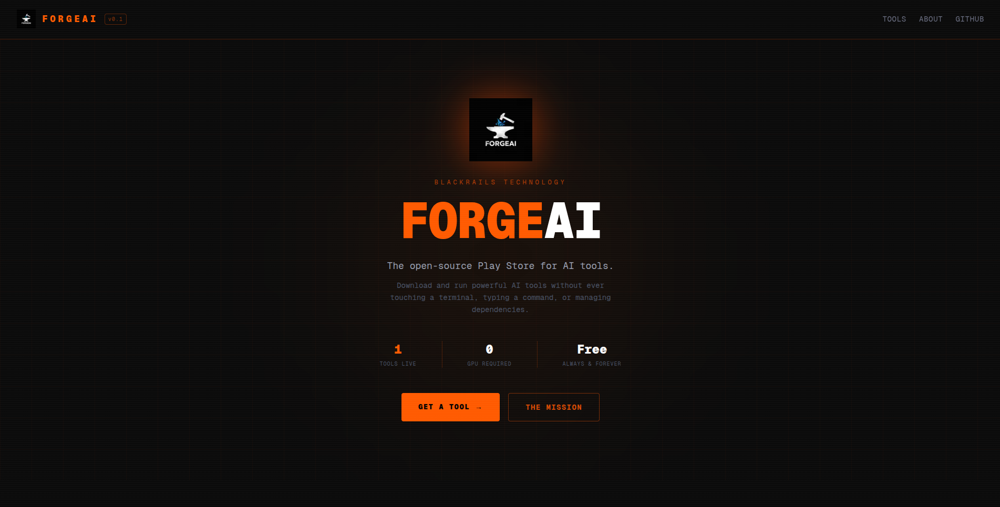

# 🚀 FORGEAI v0.1

```
 ███████╗ ██████╗ ██████╗  ██████╗ ███████╗ █████╗ ██╗
 ██╔════╝██╔═══██╗██╔══██╗██╔════╝ ██╔════╝██╔══██╗██║
 █████╗  ██║   ██║██████╔╝██║  ███╗█████╗  ███████║██║
 ██╔══╝  ██║   ██║██╔══██╗██║   ██║██╔══╝  ██╔══██║██║
 ██║     ╚██████╔╝██║  ██║╚██████╔╝███████╗██║  ██║██║
 ╚═╝      ╚═════╝ ╚═╝  ╚═╝ ╚═════╝ ╚══════╝╚═╝  ╚═╝╚═╝
```



> **The open-source Play Store for AI tools** — Download and run powerful AI tools without ever touching a terminal, typing a command, or managing dependencies.

[](https://github.com/Blackrails-Technologies/forgeai)
[](LICENSE)
[](https://nextjs.org/)
[](https://www.typescriptlang.org/)

✅ Live site: https://forgeai-v-0-1.vercel.app/ (deployed via Vercel)

---

## 🎯 What is ForgeAI?

ForgeAI is a revolutionary platform that democratizes access to AI tools by eliminating the traditional barriers of installation and setup. Think of it as the **App Store for AI** — but completely open-source and focused on developer tools.

### ✨ Key Features

- **🖱️ One-Click Installation**: Double-click installers, no terminal required
- **🔒 Isolated Environments**: Each tool runs in its own virtual environment
- **📦 Dependency Management**: Automatic handling of Python packages, system libraries, and requirements
- **🎨 Beautiful Web Interface**: Modern, cyberpunk-inspired UI built with Next.js and Tailwind CSS
- **🔧 Cross-Platform**: Windows, macOS, and Linux support
- **🚀 Extensible Architecture**: Easy to add new AI tools to the platform

### 🛠️ Current Tools

| Tool                        | Category   | Status  | Description                                                      |
| --------------------------- | ---------- | ------- | ---------------------------------------------------------------- |
| **Open Interpreter**        | Automation | ✅ Live | AI coding agent that runs Python, JS, and shell commands locally |
| _More tools coming soon..._ |            |         |                                                                  |

---

## 📁 Project Structure

```
forgeai_v.0.1/
├── app/                          # Next.js App Router
│   ├── api/
│   │   └── download/[tool]/      # API route for tool downloads
│   ├── globals.css               # Global styles (Tailwind + custom)
│   ├── layout.tsx                # Root layout with metadata
│   ├── page.tsx                  # Homepage with hero & featured tools
│   └── tools/
│       ├── page.tsx              # Tools listing page
│       └── [id]/                 # Dynamic tool detail pages
├── components/                   # Reusable React components
│   ├── NavBar.tsx                # Navigation component
│   └── ToolCard.tsx              # Tool display card
├── installer/                    # Backend installation system
│   ├── install.py                # Python installer script
│   └── tools.json                # Tool configuration database
├── public/                       # Static assets
│   ├── installers/               # Platform-specific installers
│   │   └── open_interpreter/     # Open Interpreter installers
│   │       ├── install_open_interpreter.bat
│   │       ├── install_open_interpreter.command
│   │       └── install_open_interpreter.sh
│   ├── logo.png                  # ForgeAI logo
│   └── *.svg                     # UI icons
├── package.json                  # Node.js dependencies
├── next.config.ts                # Next.js configuration
├── tailwind.config.*             # Tailwind CSS config
└── tsconfig.json                 # TypeScript configuration
```

### 🏗️ Architecture Overview

**Frontend (Next.js + React + TypeScript)**

- Modern web interface with cyberpunk aesthetic
- Responsive design with Tailwind CSS
- Client-side routing and dynamic tool pages
- API integration for installer downloads

**Backend (Python + Shell Scripts)**

- Cross-platform installer system
- Virtual environment management
- Automatic dependency resolution
- Logging and error handling

**Tool Registry (JSON Configuration)**

- Centralized tool definitions
- Version management
- Platform-specific installer mapping
- Metadata for UI display

---

## 🎓 Learning Project Statement

### 📚 Educational Purpose

**ForgeAI is a learning project** created to explore modern web development, cross-platform software distribution, and AI tool ecosystem design. This project is built for educational purposes and serves as a portfolio piece demonstrating:

- **Full-Stack Development**: Next.js, React, TypeScript, Python
- **Cross-Platform Engineering**: Windows, macOS, Linux compatibility
- **UI/UX Design**: Modern web interfaces and user experience
- **DevOps & Deployment**: Build systems, packaging, distribution
- **Open-Source Collaboration**: Community-driven development

### 💰 Non-Commercial Intent

**We do not intend to make money** from the contributions, ideas, or work of other developers. This project:

- ✅ **Respects Open-Source**: All code is MIT-licensed
- ✅ **Credits Contributors**: Proper attribution for all contributions
- ✅ **Encourages Learning**: Focus on education over monetization
- ✅ **Shares Knowledge**: Documentation and tutorials for others
- ✅ **Collaborates Freely**: No proprietary claims on community ideas

### 🤝 Community Guidelines

- **Contribute Freely**: Share ideas, code, and improvements
- **Learn Together**: Ask questions, share knowledge, help others
- **Respect Others**: Credit sources, avoid plagiarism
- **Build Together**: Focus on collective improvement
- **Stay Ethical**: No commercial exploitation of community work

---

## 🚀 Getting Started

### Prerequisites

- **Node.js** 18+ and **npm**
- **Python** 3.9+ (for running tools locally)
- **Git** for cloning the repository

### Installation

1. **Clone the repository**

   ```bash
   git clone https://github.com/Blackrails-Technologies/forgeai.git
   cd forgeai
   ```

2. **Install dependencies**

   ```bash
   npm install
   ```

3. **Start development server**

   ```bash
   npm run dev
   ```

4. **Open your browser**
   ```
   http://localhost:3000
   ```

### 🏗️ Build for Production

```bash
npm run build
npm start
```

---

## 💻 Usage

### For Users

1. **Browse Tools**: Visit the homepage to see available AI tools
2. **Choose Platform**: Select your operating system (Windows/macOS/Linux)
3. **Download Installer**: Click the download button for your platform
4. **Run Installer**: Double-click the downloaded file
5. **Use Tool**: The AI tool launches automatically after installation

### For Developers

#### Adding New Tools

1. **Create Tool Configuration** in `installer/tools.json`:

   ```json
   {
     "id": "your-tool",
     "name": "Your Tool Name",
     "description": "What your tool does",
     "pip_package": "your-pip-package",
     "launch_cmd": "your-launch-command",
     "min_python": "3.9"
   }
   ```

2. **Create Installers** in `public/installers/your_tool/`:
   - `install_your_tool.bat` (Windows)
   - `install_your_tool.command` (macOS)
   - `install_your_tool.sh` (Linux)

3. **Update Frontend** in `app/page.tsx` and `app/tools/page.tsx`

4. **Test Installation** across all platforms

---

## 🤝 Contributing

We welcome contributions! This is a learning project, so feel free to:

### Ways to Contribute

- **🐛 Bug Reports**: Found an issue? [Open an issue](https://github.com/Blackrails-Technologies/forgeai/issues)
- **💡 Feature Requests**: Have an idea? [Start a discussion](https://github.com/Blackrails-Technologies/forgeai/discussions)
- **🔧 Code Contributions**: Fix bugs or add features
- **📚 Documentation**: Improve docs, tutorials, or examples
- **🎨 Design**: UI/UX improvements or new themes
- **🛠️ Tool Additions**: Add new AI tools to the platform

### Development Workflow

1. **Fork** the repository
2. **Create** a feature branch: `git checkout -b feature/your-feature`
3. **Make** your changes
4. **Test** thoroughly across platforms
5. **Commit** with clear messages: `git commit -m "Add: your feature description"`
6. **Push** to your fork: `git push origin feature/your-feature`
7. **Open** a Pull Request

### Code Standards

- **TypeScript**: Strict type checking enabled
- **ESLint**: Code linting and formatting
- **Prettier**: Consistent code formatting
- **Testing**: Write tests for new features
- **Documentation**: Update README for significant changes

---

## 📋 Requirements

### System Requirements

- **RAM**: 4GB minimum, 8GB recommended
- **Storage**: 1GB free space for tools + dependencies
- **Network**: Internet connection for downloads

### Supported Platforms

- **Windows**: 10/11 (x64)
- **macOS**: 12+ (Intel/Apple Silicon)
- **Linux**: Ubuntu 20.04+, CentOS 8+, Fedora 34+

---

## 🔒 Security & Privacy

- **Isolated Environments**: Each tool runs in its own virtual environment
- **No Data Collection**: ForgeAI doesn't collect or transmit user data
- **Local Execution**: All AI tools run locally on your machine
- **Open Source**: Security through transparency
- **Regular Updates**: Dependencies kept current

---

## 📞 Support

- **Issues**: [GitHub Issues](https://github.com/Blackrails-Technologies/forgeai/issues)
- **Discussions**: [GitHub Discussions](https://github.com/Blackrails-Technologies/forgeai/discussions)
- **Documentation**: This README and inline code comments

---

## 📄 License

**MIT License** - see [LICENSE](LICENSE) file for details.

```
Copyright (c) 2024 BlackRails Technology

Permission is hereby granted, free of charge, to any person obtaining a copy
of this software and associated documentation files (the "Software"), to deal
in the Software without restriction, including without limitation the rights
to use, copy, modify, merge, publish, distribute, sublicense, and/or sell
copies of the Software, and to permit persons to whom the Software is
furnished to do so, subject to the following conditions:

The above copyright notice and this permission notice shall be included in all
copies or substantial portions of the Software.
```

---

## 🙏 Acknowledgments

- **Open Interpreter**: For inspiring this project
- **Next.js Community**: For the amazing framework
- **Tailwind CSS**: For the utility-first CSS framework
- **Python Community**: For the ecosystem that makes AI accessible
- **All Contributors**: For their time, ideas, and code

---

## 🎯 Roadmap

### v0.2 (Coming Soon)

- [ ] Multiple AI tool support
- [ ] Tool update system
- [ ] User feedback system
- [ ] Improved installer UX

### Future Versions

- [ ] Plugin system for custom tools
- [ ] Tool marketplace
- [ ] Collaborative tool development
- [ ] Mobile app companion

---

```
╔═══════════════════════════════════════════════════════════════════════════════╗
║                           BlackRails Technology                               ║
║                          Building the Future of AI                            ║
║                    https://github.com/Blackrails-Technologies                 ║
╚═══════════════════════════════════════════════════════════════════════════════╝
```

---

_Built with ❤️ by the open-source community • No AI tools were harmed in the making of this platform_
